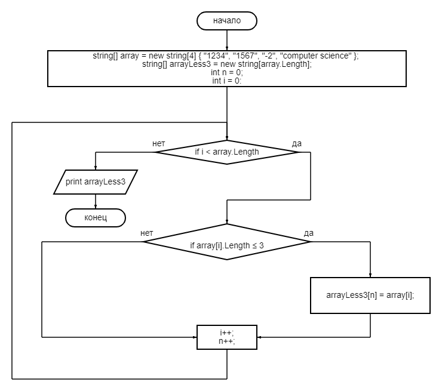

## Описание решения задачи
1. Для начала вводим следующие переменные с массивами строк:
* массив (string) с исходными данными;
* пустой массив (string) с длиной строк как у первого массива;
2. Создаем ничего не возвращающий метод void для проверки условий, который на вход принимает 2 массива (srting). В этом методе делаем следующее:
* вводим переменную n, равноу нулю (будет нашим счетчиком).
* задаем цикл for, и проверяем условие: если длина i-ого элемента первого массива меньше либо равна трех, то n-ый элемент второго массива будет равен i-ому элементу первого массива. 
* при этом не забываем, что i инкрементируем, а также инкрементируем n.
3. Создаем метод void для вывода массива, который принимает на вход один массив (string). Создаем цикл for, выводим каждый элемент массива. 
4. Наконец, выводим первый метод (для проверки условий), с вводными двумя массивами. 
5. Далее выводим второй метод (для вывода массива) со вторым введенным массивом.
6. Конец.

Также, прилагаю блок-схему решения задачи:

